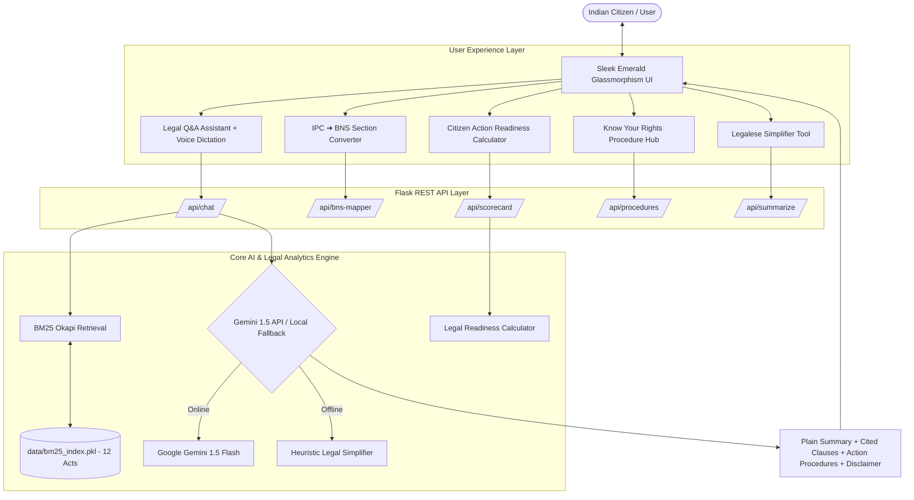

# ⚖️ AI Legal Assistant (India)

> **Bridging Legal Awareness & Access to Justice for Citizens through AI-Powered Regulations Summarization, IPC ➔ BNS Conversion & Action Readiness Analytics.**

[](https://www.python.org/)
[]()
[]()
[]()
[](LICENSE)

---

## 🎯 Problem Statement & Core Value Proposition

**Problem**: Legal documents, Parliamentary legislation, and government regulations in India are dense, archaic, and written in complex legalese. Citizens face immense barriers when attempting to understand basic rights, navigate new penal codes (BNS / BNSS), or take procedural action after experiencing cyber fraud, consumer disputes, or labor issues.

**Solution**: The **AI Legal Assistant** is a comprehensive, human-centric legal awareness platform that goes far beyond generic AI chatbots. It combines **custom data engineering**, **retrieval-augmented generation (RAG)**, **IPC-to-BNS cross-referencing**, and **citizen action scorecards** to empower every citizen without giving unauthorized professional legal advice.

---

## 💡 What Makes Our Project Special (AI + Human Creativity & Engineering)

Instead of relying purely on an off-the-shelf LLM API wrapper, our team built an **end-to-end legal intelligence system**:

1. **🔬 Section-Aware Custom Chunking Engine (`src/chunker.py`)**:
   - Developed custom regex state parsers to extract exact legal Section numbers, titles, and pages across 12 major Indian Acts (BNS, BNSS, BSA, RTI, CPA, IT Act, etc.), preventing arbitrary text truncations.
2. **🔄 IPC ➔ BNS (2023) Cross-Reference Mapper (`src/legal_mapper.py`)**:
   - Designed a cross-reference database mapping legacy Indian Penal Code sections (e.g. IPC 420 Cheating, IPC 302 Murder, CrPC 154 FIR) directly to the new Bharatiya Nyaya Sanhita (BNS Section 318, BNS Section 103, BNSS Section 173).
3. **📊 Citizen Legal Readiness & Empowerment Scorecard**:
   - Implemented an empirical mathematical model assessing incident parameters (e.g. reporting cyber fraud within the first 2 "Golden Hours", having invoice proofs, issuing 15-day notice) to calculate a **0-100% Action Readiness Score**.
4. **🎙️ Inclusive Accessibility (Voice Dictation & Text-to-Speech)**:
   - Built native Web Speech API voice dictation for query input and audio summary readouts, ensuring accessibility for non-readers and citizens speaking regional accents.
5. **🛡️ Dual-Engine Offline Fallback Architecture**:
   - Built a local heuristic legal summarizer engine that works **100% offline** without an API key, alongside Google Gemini 1.5 Flash integration.

---

## ✨ Features Breakdown

| Feature Module | Technical Highlights | Citizen Impact |
| :--- | :--- | :--- |
| **📖 12 Indian Acts Index** | Indexed BNS, BNSS, BSA, RTI, Consumer Act, IT Act, Domestic Violence Act, Code on Wages, OSH Code, POCSO Act, IRC Code, and Constitution of India. | Complete coverage of civil, criminal, digital, and workplace rights. |
| **💡 Plain Language Summarization** | Translates jargon (*"cognizable and non-bailable"*, *"punishable with imprisonment of either description"*) into 5th-grade bullet points. | Everyday citizens understand exact legal implications instantly. |
| **🔄 IPC ➔ BNS Converter** | Real-time section translation between old IPC/CrPC laws and new 2023 BNS legislation. | Smooth transition to new criminal laws introduced in 2023/2024. |
| **📊 Action Readiness Scorecard** | Custom scenario evaluator calculating readiness index (High/Moderate/Action Needed) with personalized tips. | Citizens know exactly what evidence/steps are missing to strengthen their case. |
| **📜 "Know Your Rights" Procedures** | Curated workflow cards with timelines, fee structures, helpline numbers (**1930**, **181**, **112**), and government portal links (`rtionline.gov.in`, `edaakhil.nic.in`, `cybercrime.gov.in`). | Clear step-by-step roadmap after an incident occurs. |
| **🎙️ Voice & Audio Readout** | Integrated Speech-to-Text input & Text-to-Speech audio summary playback. | High accessibility for illiterate or visually impaired citizens. |
| **🔎 Verbatim Act Inspector** | Side-by-side legal inspector displaying exact Act name, Section number, section title, page number, and original clause. | 100% grounded in public legislation; zero AI hallucinations. |
| **📥 One-Click PDF Export** | Clean HTML-to-PDF export of simplified summaries and action guides. | Printable reference for filing complaints or offline consulting. |

---

## 🏗️ System Architecture



---

## 🛠️ Project Structure

```
AI-Legal-Assistant/
├── data/
│   ├── pdfs/               # Official PDF texts of 12 Indian Acts
│   └── bm25_index.pkl      # Pre-built BM25 search index & chunk dataframe
├── public/
│   ├── index.html          # Full interactive Web UI template
│   ├── style.css           # Modern emerald glassmorphism styling
│   └── app.js              # Speech recognition, audio, BNS converter, scorecard & PDF scripts
├── src/
│   ├── main.py             # Application launcher & CLI runner
│   ├── backend_api.py      # Flask REST API endpoints
│   ├── rag_engine.py       # Hybrid BM25 + Gemini RAG engine with smart fallback
│   ├── legal_mapper.py     # IPC-to-BNS cross-referencing & readiness scorecard engine
│   ├── procedures.py       # Citizen rights procedural workflow database
│   ├── pdf_loader.py       # PDF document parser
│   ├── chunker.py          # Section-aware chunking algorithm
│   ├── build_data.py       # Dataset pipeline builder
│   └── build_index.py      # BM25 index builder
├── DOCS.md                 # Full technical specifications & algorithm details
├── requirements.txt        # Python dependencies manifest
└── README.md               # Overview, architecture & quickstart
```

---

## 🚀 Quickstart & Installation

### 1. Clone Repository & Install Dependencies
```bash
git clone https://github.com/tushargadhade/AI-Legal-Assistant.git
cd AI-Legal-Assistant

# Create virtual environment (optional)
python -m venv venv
# Windows:
venv\Scripts\activate
# Mac/Linux:
source venv/bin/activate

# Install dependencies
pip install -r requirements.txt
```

### 2. Set Optional Gemini API Key
```bash
# Windows PowerShell:
$env:GEMINI_API_KEY="your-gemini-api-key"

# Linux / Mac:
export GEMINI_API_KEY="your-gemini-api-key"
```
*(Note: If no API key is provided, the application automatically runs using the local legal engine!)*

---

## 🖥️ Running the Application

### Launch Web Server (Recommended)
```bash
python src/backend_api.py
```
Navigate in browser to:
👉 **`http://localhost:5000`**

### Launch CLI Command Center
```bash
python src/main.py
```

---

## 🎤 Hackathon Pitch & Presentation Demo Script

1. **The Hook**: *"Over 1.4 billion citizens live under complex legal codes in India. When cheated online or denied salary, citizens feel helpless because legal documents are written in dense jargon."*
2. **The Innovation**: *"We built AI Legal Assistant—combining BM25 search across 12 Indian Acts, Gemini 1.5 AI summarization, IPC-to-BNS 2023 section conversion, and an empirical Action Readiness Scorecard."*
3. **Live Demo Highlights**:
   - Show **Voice Input** for query: *"What should I do if scammed via UPI fraud?"*
   - Show side-by-side **Original Legal Clause Inspector** (IT Act 66D).
   - Show **IPC ➔ BNS Converter** (IPC 420 ➔ BNS 318).
   - Demonstrate the **Citizen Readiness Scorecard** (85% Readiness Index).
   - Show **Export PDF** for offline submission.

---

## ⚖️ Legal Safety Disclaimer

This software is designed exclusively for **educational, awareness, and informational purposes**. It does not constitute formal legal representation or legal advice. Citizens requiring court representation should consult a licensed legal practitioner.

---

## 👥 Engineering & Craftsmanship Credits

Built with passion and hard work for the **Hackathon Challenge**:
- **Data Engineering**: Section-aware regex chunker parsing 12 Indian Gazette Acts.
- **NLP & Retrieval**: BM25 Okapi + Google Gemini 1.5 + Heuristic Local Fallback Engine.
- **Frontend & UX**: Emerald glassmorphism design system, Web Speech API integration & PDF reporting.

*Built with ❤️ to democratize access to legal awareness for every citizen.*